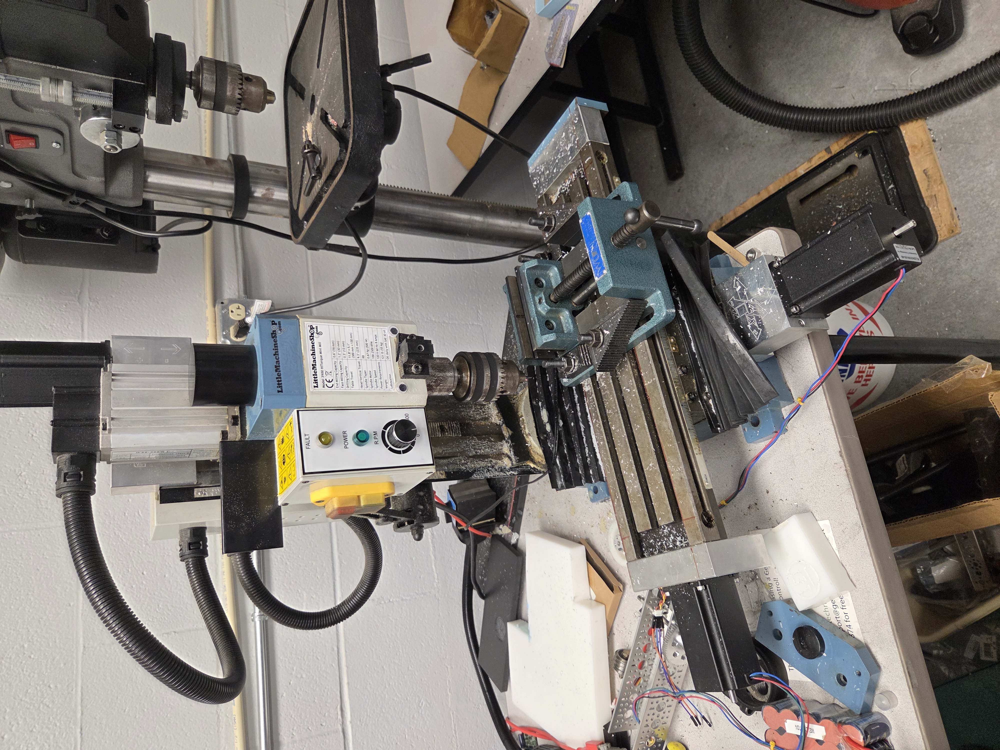
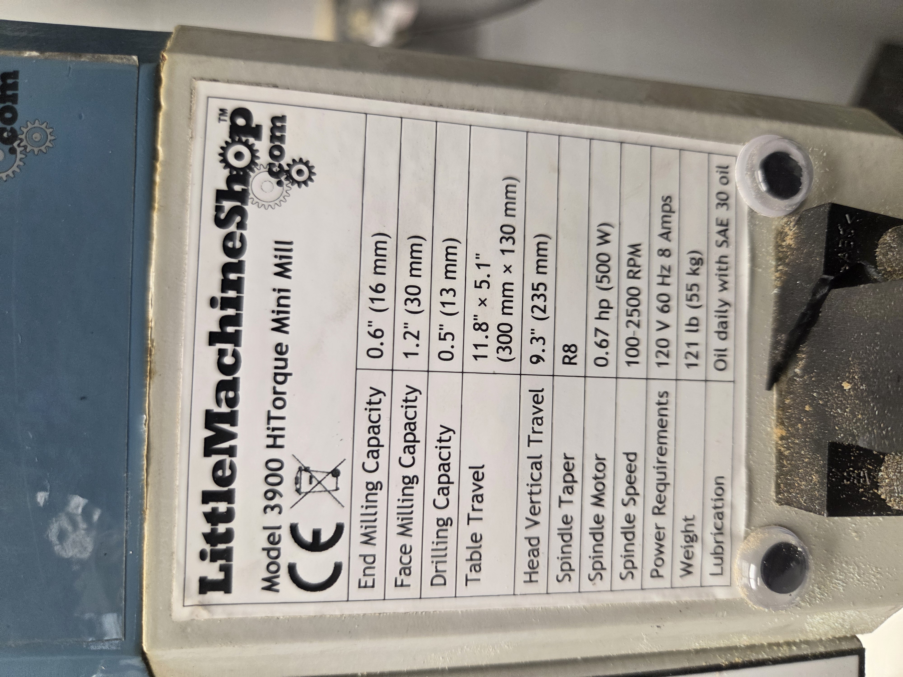
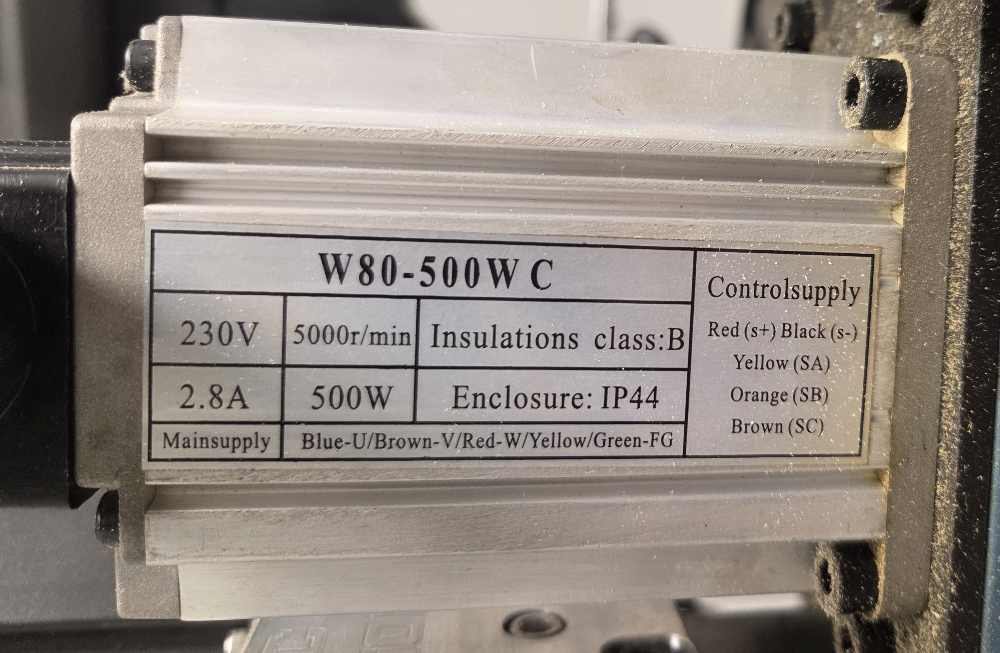

# Mill Base
## Base Mill Model
### This machine is based around a Little Machine Shop HiTorque 3990 Mini Mill.

Refer to the 
[LMS 3990 Manual](../../../Datasheets/HiTorque3990MiniMill/6450_mini_mill_users_guide.pdf)
for details.

## Specs and Limitations
### Mill Specs

### Spindle Specs

### Limitations
- Mill not originally designed for CNC use, lots of backlash in motion system as a result
- Bed is not hugely ridged, will deflect on heavy cuts
- Spindle will overheat on long jobs if not given time to pause and cool down
- Spindle cannot be controled by computer, only by knob on front of mill
- Due to construction quality, can only reliably cut non-metals, with the exception of alumium and brass