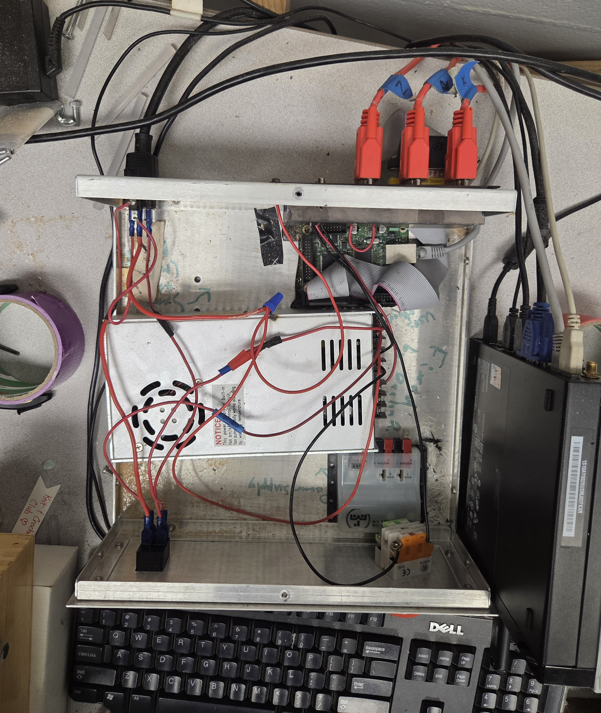
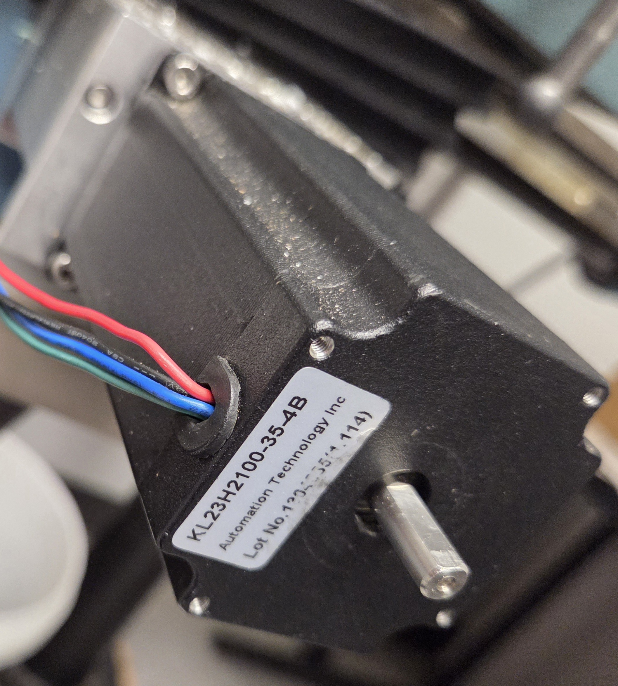
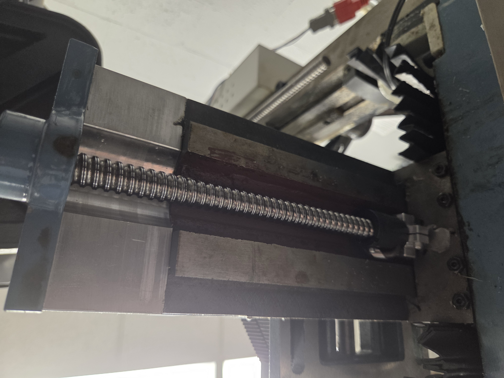
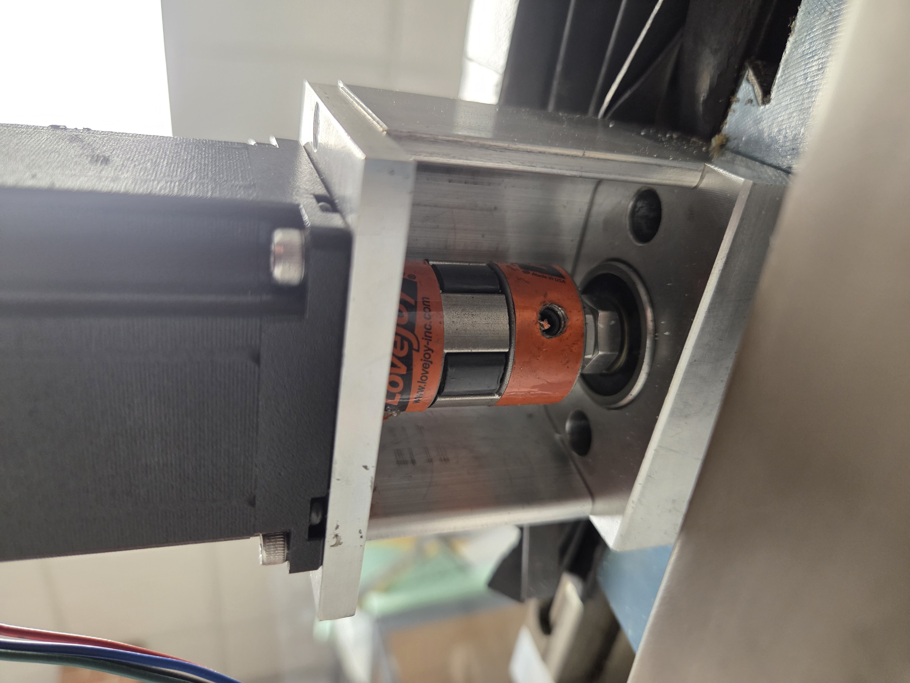

# CNC Conversion

## Control Box

Takes instructions from Mach 3 on computer, drives stepper motors

Open stepper driver slot for 4th axis. Not currently present, but fully supported by hardware and software.

## Stepper motors

KL23H2100-35-4B

NEMA23 Stepper Motor

381oz/in 3.5A Dual Shaft   

## Modified Lead Screws

Using high precision ball screws for motion on all 3 axis

Backlash introduced through sloppy connection between ball screw nut and mill axis. (Slightly fixed by adding shims to connector)

Motors connected via flexible jaw shaft couplers

