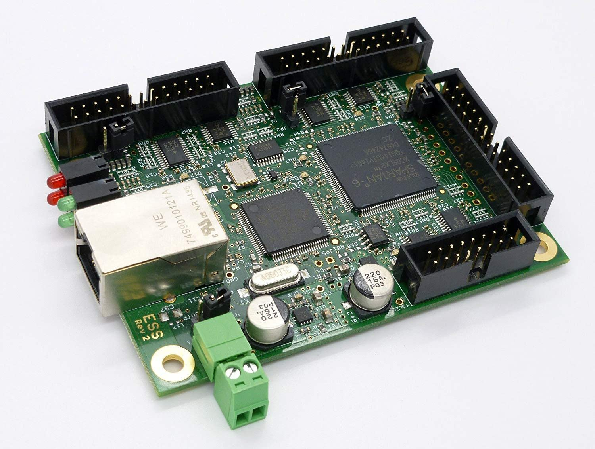
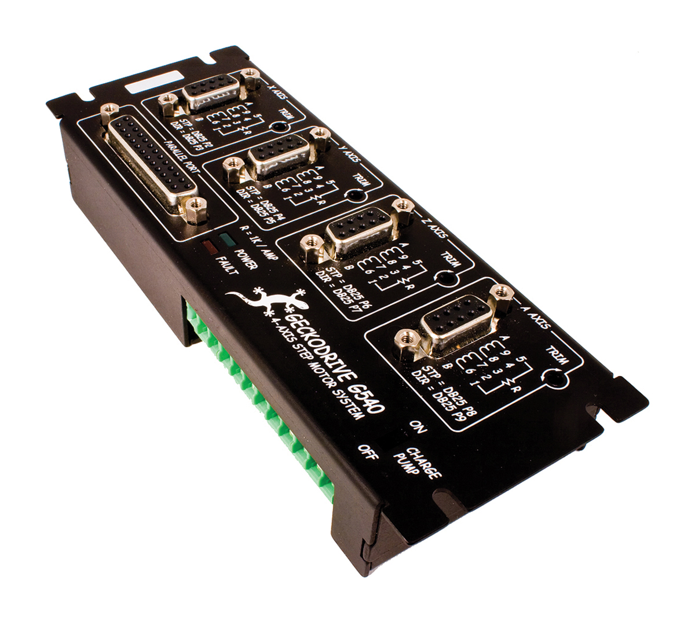
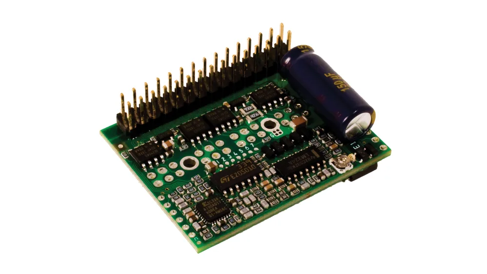

# Electronics

## Layout

The drive electronics inside the electronics metal housing box are connected as shown in the diagram below.

## Component Details

**Motion Controller**

*Warp 9 Ethernet Smooth Stepper (ESS)*

The Ethernet Smooth Stepper motion controller takes instructions from Mach 3 sent to it over an ethernet connection and converts them into step signals for the stepper driver.

It connects to the GeckDrive G540 Stepper Driver via a 26 wire ribbon cable attatched to Port 1 of the ESS board, and to the "Parallel Port" connector on the front of the GeckoDrive module.

The ESS also requires its own external 5V power source to run, this is supplied by a modified USB cable connected to the control computer.

[Warp 9 ESS Datasheet](../../../Datasheets/Warp9ESS/Warp9_Documentation_ESS_Ethernet_SmoothStepper.pdf)

**Stepper Driver**

*Gecko Drive G540*

The Gecko Drive G540 stepper driver module takes signals from the ESS motion controller and converts them into high power pulses to move the stepper motors.

The stepper driver is connected to the motors for each axis via the DE-15 connectors on the front panel. The 4th "A" axis channel is functional, but not connected due to the lack of a fourth axis on the machine. (This can be added in the future!) 24V DC power in is provided to the module via pins 1-3 of a screw terminal header on the back of the module.

The G540 internally consists of 4 smaller G250 stepper driver sub-modules, which are replacable in the event that one gets damaged.

[Gecko Drive G540 Datasheet](../../../Datasheets/GeckoDriveG540/G540-MANUAL-REV4.pdf)

