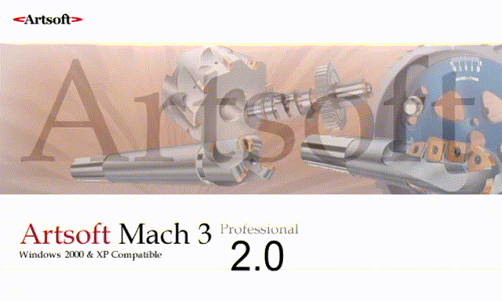
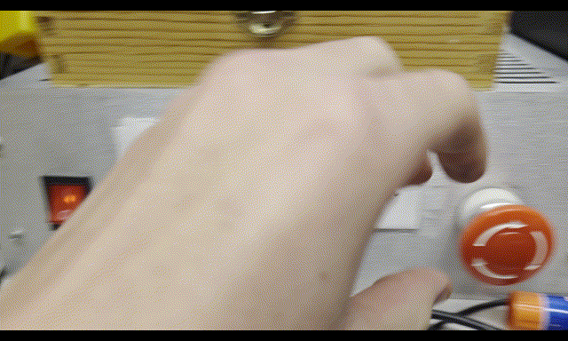
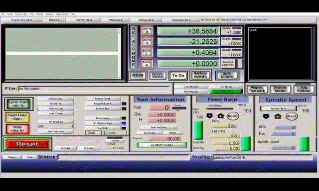

# Running A Job

### Once you have your gcode generated and the mill set up, you will likely now want to run the operation you just created.

## Log in to the computer and launch Mach 3 using the shortcut on the desktop

## Turn on the mill controller and reset Mach 3

## Load the gcode file you want to run and take note of the origin point

## Press tab to open the jog menu, then jog the tool to the origin point.
## home all three axes in Mach 3 by pressing the "Ref All Home" button.
## If it does not do so automatically, regen the tool path in the display.

## Make sure you have no loose fitting clothes, dangling objects, or un-tied hair, then turn on the spindle and set it to the speed you want to use

## Verify everything is set up properly, then start the job using the green "Cycle Start" or Alt+R

## Once the cycle completes, shut down the mill and spindle before removing your part.

### To pause, press either the yellow "Feed Hold" button, or the space bar on the keyboard, resume using the "Cycle Start" button

### To stop the job, press the red stop button in Mach 3, or hit the e-stop on the front of the mill controller box.

# That's all!